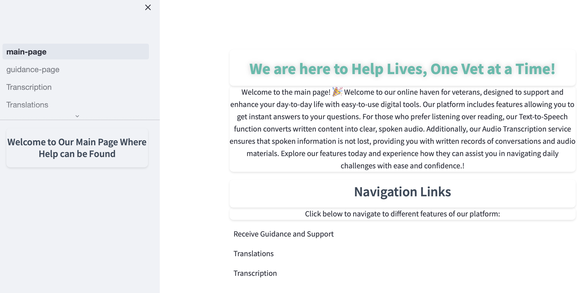

## Overview
Our chatbot is here to help homeless veterans any time they need it. It gives advice and help, our tool is always ready to answer questions and support veterans as they work to improve their lives. It's like having a steadfast ally, ready to assist at any hour..

## Project-Pink-Aid: What is it?

Project-Pink-Aid isn't just a name—it's our commitment to supporting homeless veterans through a virtual assistant tailored to their unique needs.

Self-exploration: helping veterans understand their own desires and goals.
Guidance: offering step-by-step assistance in daily activities and decisions.
Career: providing tools and advice to re-enter the workforce successfully.

We're here to help veterans harness the full potential of our chatbot, ensuring it meets their individual needs and helps them navigate their journey towards a stable, fulfilling life.

## Why Project-Pink-Aid? 

I noticed that homeless veterans in my community weren't getting much help, so I decided to do something about it. I created a chatbox that offers real help. Veterans can ask it questions like where to find job training and can even get help translating things into different languages.

Our chatbox also helps veterans improve their resumes, making it easier for them to find jobs.

Our goal is simple: Help Lives, One Vet at a Time. We're using this chatbox to make a big difference for veterans, giving them the support they need to succeed.

## Our Solution

Welcome to our online haven for veterans, designed to support and enhance your day-to-day life with easy-to-use digital tools. Our platform includes features allowing you to get instant answers to your questions. For those who prefer listening over reading, our Text-to-Speech function converts written content into clear, spoken audio. Additionally, our Audio Transcription service ensures that spoken information is not lost, providing you with written records of conversations and audio materials. Explore our features today and experience how they can assist you in navigating daily challenges with ease and confidence.

## Get My Demo Video Link

## Main-Page 

