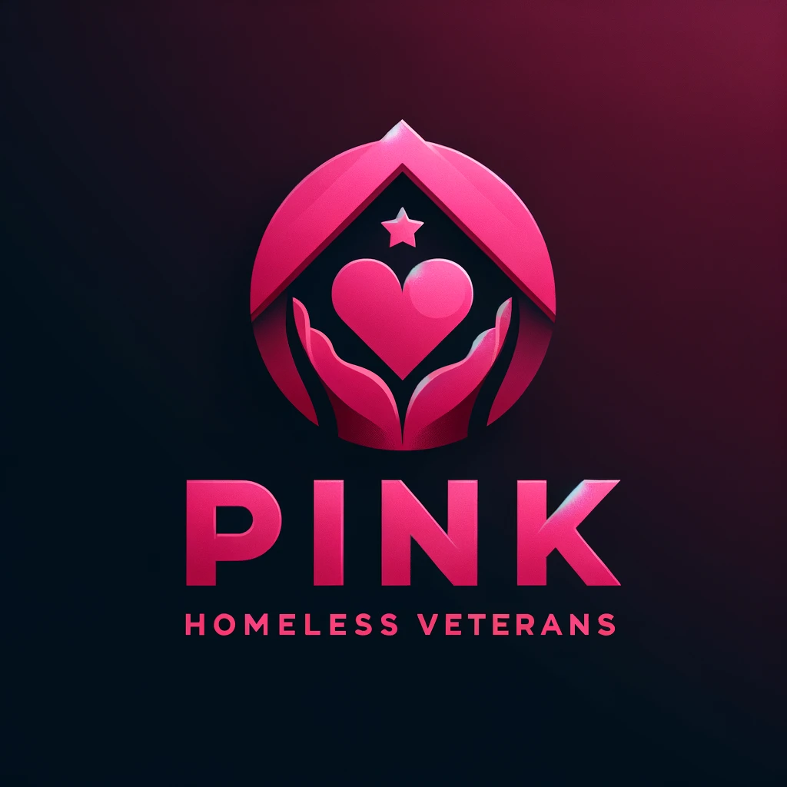

## Overview
Chatbot that assists Homeless Veterans 24/7 in exploring guidance, so they can help with life struggles they have. It gives advice and help, our tool is always ready to answer questions and support veterans as they work to improve their lives. 

## Project-Pink-Aid: What is it?
The "Project-Pink-Aid" part of our chatbot's name replies to the several sectors in which Homeless Vets are equipped with the following: Self-exploration, Guidance, and Career. That's why we designed you to take full advantage of our chatbot tool as an individual. The name Project-Pink-Aid is derived from how homeless veterans can utilize the virtual assistant in various ways as per their individual needs.

## Why Project-Pink-Aid? 

I saw the homeless veterans in my city were really struggling and this moved me to show them some love. I put together a chat box that would always offer real time help. Veterans can communicate with it by asking about places where they can get vocation training and even get translations made into different languages.

Another part of the chatbox also helps them to make their resume better such that then they can quickly find jobs.

Our main goal is to Improve Lives, One Vet at a Time. 

 

## Our Solution

Welcome to our online haven where veterans find comfort and support. This is an innovative online platform that was created to provide digital tools that will make your life simple and also improve it. You have the opportunity to use the support that enables you to get instant solutions to your inquiries. For those who enjoy listening instead of reading, our Text to Speech features convert articles into clear natural speech. Besides, we have a service that is called Audio Transcription. It entails the transcription of spoken language to text, thus preserving every single detail while overcoming the noise-minimized maximum. You can try out any of our features right now. And see how your simple every day activities can be made convenient through easy services. and confidence.

## Main-Page 

## Get My Demo Video Link
